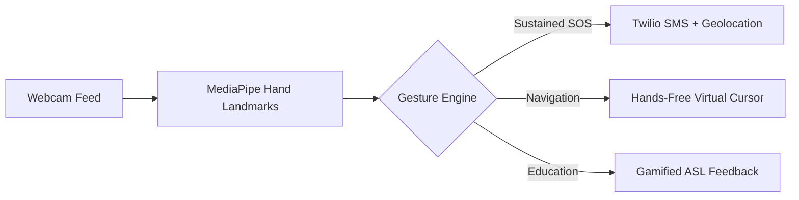
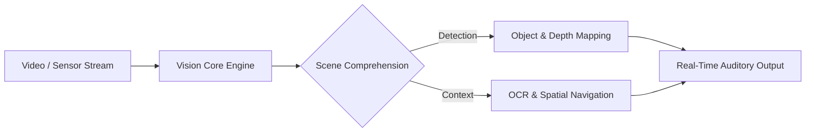

# Harshit Sharma

**Computer Science Engineering Undergraduate**

  
  
  
  

---

## About 

I am a Computer Science undergraduate based in India, focusing on machine learning systems and applied computer vision. My primary interest lies in translating foundational model architectures into practical, low-latency software applications. Outside of tech, I harbour a sweet spot for outdoor sports & selective reading.

<table>
  <tr>
    <td width="50%" valign="top">
      <b>Areas of Interest</b> 
      
      • Real-Time Computer Vision 
      • Assistive & Edge AI Systems 
      • Applied Deep Learning
      
    </td>
    <td width="50%" valign="top">
      <b>Working Principles</b> 
      
      • First-principles problem solving 
      • Prioritizing software reliability 
      • Consistent, incremental iteration
      
    </td>
  </tr>
</table>

---

## Technical Skills

  <b>Core Languages & Python AI Ecosystem</b> 
  

  
  
  
  
  
  
  
  
  
  
  
  
  
  
  

 

---

## Resume
### <a href="https://hs12214.github.io/hs12214/Harshit_Resume.pdf" target="_blank">View and Download my Resume</a>

---

  
## Featured Projects

### 1. [SignVise](https://github.com/hs12214/SignVise)
An integrated machine learning platform transforming device cameras into hands-free assistive interfaces for emergency alerts, virtual cursor navigation, and gamified ASL education.

 

### 2. [Sight X](https://github.com/hs12214)
An AI-driven real-time visual assistance platform engineered for spatial awareness, intelligent scene analysis, and low-latency auditory guidance.

---

## Activity

  
  

  

 

<code>Part Human. Part Semicolon.</code>

